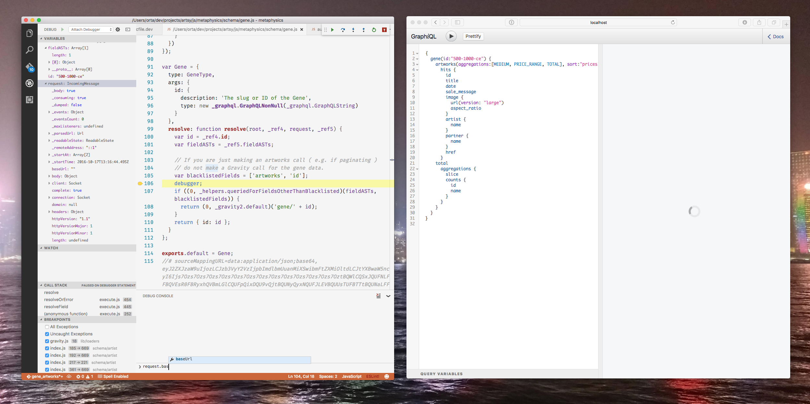

### VS Code

If you want an overview of how VS Code differs from traditional TextMate clones, read Orta's [post on the Artsy blog](http://artsy.github.io/blog/2016/08/15/vscode/).

## Running Metaphysics

Ideally you should run Metaphysics

## Debugging Metaphysics

This repo uses babel at runtime via `require('babel-core/register');` and so there are no source-mapping files, this means that VS Code does not support LOC breakpoints from your source code into the real transpiled code in Metaphysics.

You can work around this though [using the `debugger` function](https://developers.google.com/web/tools/chrome-devtools/console/command-line-reference?hl=en#debugfunction) inside your source code instead.

To start the debugger, run the debugger (VS Code defaults this to `f5`, I typically re-bind this to `cmd + r`) and the bar at the bottom should turn orange. Then in the LOC you want to debug inside, add `debugger;`. This will open the transpiled source code, and on the left in the debugger menu you can see all of the state, and the console should work at the bottom.

You can also open a new tab with `about:inspector` in Chrome and it will provide a button to load up the chrome inspector in Chrome Dev Tools.

### Related Tangentially

There is more information about using VS Code, with terminology and keybinding recommendations, inside [the Emission repo](https://github.com/artsy/emission/blob/master/docs/vscode.md).
